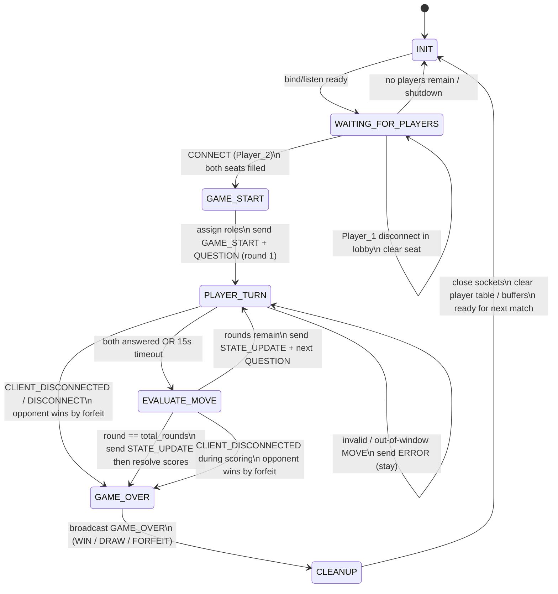

# Game State Machine (FSM) Specification — Terminal Trivia

**Student:** Ben Schlicting  
**Course:** CS 457 – Computer Networks  
**Scope:** Server-side authoritative game engine  
**Diagram format:** Mermaid `stateDiagram-v2` (GitHub-renderable)

---

## 1. Overview

The server FSM drives lobby admission, simultaneous answer windows, scoring, win/draw resolution, forfeit handling, and cleanup/reset. Clients are thin terminals; they do not own authoritative state.

Terminal Trivia is simultaneous within each round (both players answer the same question during one window), but the FSM still uses the required lifecycle states:

`INIT` → `WAITING_FOR_PLAYERS` → `GAME_START` → `PLAYER_TURN` → `EVALUATE_MOVE` → `GAME_OVER` → `CLEANUP`

---

## 2. Server-Side States

| State | Description |
|---|---|
| `INIT` | Process start / post-cleanup reset. Listening socket ready; no seated players. |
| `WAITING_FOR_PLAYERS` | Zero or one connected player. First accepted client receives `LOBBY_WAIT`. |
| `GAME_START` | Two players seated. Assign `Player_1` / `Player_2`, reset scores, emit `GAME_START`, prepare round 1. |
| `PLAYER_TURN` | Answer window open. Broadcast `QUESTION`. Accept valid `MOVE`s from either player until both answered or 15s timeout. |
| `EVALUATE_MOVE` | Score the round, broadcast `STATE_UPDATE`, decide whether more rounds remain. |
| `GAME_OVER` | Emit final `GAME_OVER` (WIN / DRAW / FORFEIT). |
| `CLEANUP` | Close sockets, clear seats/buffers, return to `INIT` for a subsequent match. |

---

## 3. Mermaid State Diagram (`stateDiagram-v2`)



---

## 4. Transition Tables

### 4.1 Happy Path

| From | Trigger | Actions | To |
|---|---|---|---|
| `INIT` | Server socket ready | Accept connections | `WAITING_FOR_PLAYERS` |
| `WAITING_FOR_PLAYERS` | First valid `CONNECT` | Seat as `Player_1`; send `LOBBY_WAIT` | `WAITING_FOR_PLAYERS` |
| `WAITING_FOR_PLAYERS` | Second valid `CONNECT` | Seat as `Player_2` | `GAME_START` |
| `GAME_START` | Roles assigned | Send `GAME_START` to both; load round 1; send `QUESTION` | `PLAYER_TURN` |
| `PLAYER_TURN` | Both answers in **or** timer expires | Freeze answer window | `EVALUATE_MOVE` |
| `EVALUATE_MOVE` | Rounds remain | Score; `STATE_UPDATE`; next `QUESTION` | `PLAYER_TURN` |
| `EVALUATE_MOVE` | Final round complete | Score; compare totals | `GAME_OVER` |
| `GAME_OVER` | Outcome published | Send `GAME_OVER` | `CLEANUP` |
| `CLEANUP` | Resources reclaimed | Reset in-memory match state | `INIT` |

### 4.2 Role Assignment

| Connect order | Assigned role | Notes |
|---|---|---|
| First accepted `CONNECT` | `Player_1` | Receives `LOBBY_WAIT` until opponent joins |
| Second accepted `CONNECT` | `Player_2` | Triggers `GAME_START` for both |
| Third+ `CONNECT` | *(rejected)* | `ERROR` code `ROOM_FULL`; socket closed |

### 4.3 Move Validation Inside `PLAYER_TURN`

| Condition | Server response | State change |
|---|---|---|
| Valid `MOVE` (`choice` ∈ A–D, matching `round`, first answer) | Record answer; optional lightweight `STATE_UPDATE` (`answered` flags) | Remain in `PLAYER_TURN` |
| Duplicate answer same round | `ERROR` (`ALREADY_ANSWERED`) | Remain in `PLAYER_TURN` |
| `MOVE` outside answer window / wrong state | `ERROR` (`OUT_OF_TURN`) | Remain in current state |
| Bad choice / bad types | `ERROR` (`INVALID_MOVE`) | Remain in `PLAYER_TURN` |
| Malformed JSON / unknown type | `ERROR` (`MALFORMED` / `UNKNOWN_TYPE`) | Remain; do not crash loop |
| Both players answered | Begin scoring | → `EVALUATE_MOVE` |
| 15-second timeout with missing answers | Missing answers treated as incorrect | → `EVALUATE_MOVE` |

Invalid and out-of-turn moves **never** crash the server loop and **never** advance scoring by themselves.

---

## 5. Scoring & Outcome Logic (`EVALUATE_MOVE` → `GAME_OVER`)

1. Compare each recorded choice to the authoritative correct answer.
2. Award `+1` per correct answer; `0` for wrong / missing.
3. Broadcast `STATE_UPDATE` with `last_round_result` and running `scores`.
4. If `round < total_rounds` (10): increment round → `PLAYER_TURN`.
5. Else enter `GAME_OVER`:
   - Higher score → `result: "WIN"`, `winner: <role>`
   - Equal scores → `result: "DRAW"`, `winner: null`

---

## 6. Disconnect & Forfeit Paths

### 6.1 Graceful Application Disconnect

Client sends `DISCONNECT` then closes the socket.

| Current state | Handling |
|---|---|
| `WAITING_FOR_PLAYERS` | Remove seat; stay waiting or return toward `INIT` |
| `GAME_START` / `PLAYER_TURN` / `EVALUATE_MOVE` | Opponent wins by forfeit → `GAME_OVER` → `CLEANUP` |
| `GAME_OVER` / `CLEANUP` | Ignore redundant disconnects; finish cleanup |

### 6.2 Transport EOF (0-byte `recv`)

Clean TCP FIN produces `recv() -> b""`. Treat identically to application disconnect for FSM purposes (opponent forfeit if match active).

### 6.3 Abrupt Drop (RST / exceptions)

Catch `ConnectionResetError`, `BrokenPipeError`, `ConnectionAbortedError`, and optional `TimeoutError`. Trigger the same `CLIENT_DISCONNECTED` transition used for EOF.

### 6.4 Forfeit `GAME_OVER` Payload Shape

```json
{
  "msg_type": "GAME_OVER",
  "player_id": "SERVER",
  "payload": {
    "result": "FORFEIT",
    "winner": "Player_1",
    "reason": "opponent_disconnect",
    "final_scores": {"Player_1": 3, "Player_2": 2},
    "rounds_played": 5
  },
  "timestamp": 1727000150
}
```

---

## 7. Pseudo-code Game Loop

```text
state = INIT
while server_running:
    if state == INIT:
        reset_match_tables()
        state = WAITING_FOR_PLAYERS

    elif state == WAITING_FOR_PLAYERS:
        on CONNECT: seat_player()
        if seated_count == 1: send LOBBY_WAIT
        if seated_count == 2: state = GAME_START
        on disconnect: clear_seat()

    elif state == GAME_START:
        assign_roles(Player_1, Player_2)
        scores = {P1:0, P2:0}; round = 1
        broadcast GAME_START
        broadcast QUESTION(round)
        state = PLAYER_TURN

    elif state == PLAYER_TURN:
        accept MOVE / DISCONNECT / socket events until both answered or timeout
        on invalid MOVE: send ERROR; continue
        on disconnect: state = GAME_OVER (forfeit)
        else: state = EVALUATE_MOVE

    elif state == EVALUATE_MOVE:
        score_round(); broadcast STATE_UPDATE
        if disconnect observed: state = GAME_OVER (forfeit)
        elif round < 10: round += 1; broadcast QUESTION; state = PLAYER_TURN
        else: state = GAME_OVER

    elif state == GAME_OVER:
        broadcast GAME_OVER (WIN/DRAW/FORFEIT)
        state = CLEANUP

    elif state == CLEANUP:
        close_client_sockets(); clear buffers
        state = INIT
```

---

## 8. Post-Game Reset

`CLEANUP` always returns the engine to `INIT` so a subsequent pair of clients can play without restarting the Python process. Listening socket remains open across matches unless the operator shuts the server down.

---

## 9. Acceptance Checklist (FSM)

- [x] Mermaid `stateDiagram-v2` embedded directly in this Markdown file
- [x] Required states modeled: `INIT`, `WAITING_FOR_PLAYERS`, `GAME_START`, `PLAYER_TURN`, `EVALUATE_MOVE`, `GAME_OVER`, `CLEANUP`
- [x] Role assignment (`Player_1` / `Player_2`) documented
- [x] Invalid / out-of-turn moves send `ERROR` and stay in-state
- [x] Graceful and abrupt disconnects produce forfeit → `GAME_OVER` → `CLEANUP`
- [x] Post-game reset path (`CLEANUP` → `INIT`) defined
